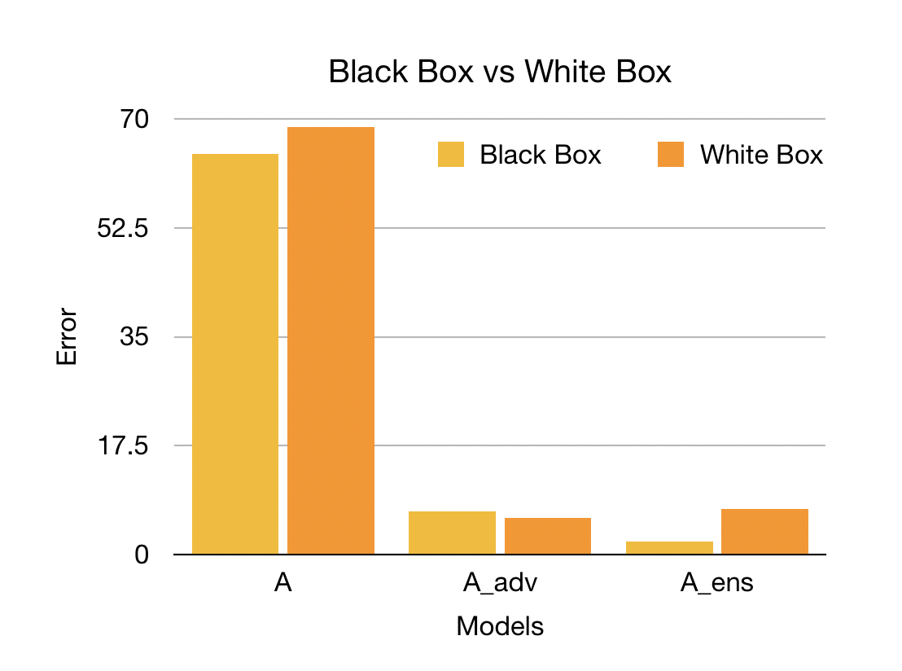

# Ensemble Adversarial Training and Random FGSM

## Problem Statement

Deep learning models can be vulnerable to maliciously perturbed inputs known as adversarial examples. These examples are crafted by making slight and often unnoticeable changes to the original inputs. In this project, we examine a new adversarial defense method (Ensemble adversarial training) and a new adversarial attack method (Random FGSM). Traditional adversarial training uses perturbed inputs generated by the model’s own parameters to increase robustness. This approach works by creating sharp curvatures in the loss of a model near data points which masks the true direction of the steepest ascent. This gradient masking degrades the linear approximation of a model’s loss used by fast single step attack methods, like FGSM.

This project focuses on exploiting gradient masking using Random FGSM and defending against gradient masking using Ensemble adversarial training. Last, we go beyond the scope of the original work to explore what impact the length of the random step (hereinafter referred to as alpha) has on the overall effectiveness of Random FGSM. See below for more details.

## Input and Output

Input: a clean image (e.g. original MNIST image).  
Output: a perturbed image (e.g. adversarial MNIST image).

## Deliverables
* [Pretrained models](https://github.com/servantez/CS496_Advanced_DL/tree/master/models) (undefended, adversarial and ensemble trained models)
* Script for [training models](https://github.com/servantez/CS496_Advanced_DL/blob/master/train_script.py)
* Script for [testing attack and defense performance](https://github.com/servantez/CS496_Advanced_DL/blob/master/test_script.py)
* Script for [identifying optimal alpha norm](https://github.com/servantez/CS496_Advanced_DL/blob/master/alpha_script.py) for Random FGSM attack 
* Code for [Ensemble adversarial training](https://github.com/servantez/CS496_Advanced_DL/blob/master/train_adv.py) and [Random FGSM attack](https://github.com/servantez/CS496_Advanced_DL/blob/master/simple_eval.py)
* [Dockerfile](https://github.com/servantez/CS496_Advanced_DL/blob/master/Dockerfile) used to build docker image
* [Docker image](https://hub.docker.com/r/servantez/ensemble) (ready to deploy)

## Experiments

All figures and data depicted below were generated for this project.

### Ensemble Adversarial Training

Ensemble adversarial training decreases the magnitude of gradient masking by training on perturbed inputs generated by other static pretrained models. The results below show that this approach significantly improves robustness to black box attacks over traditional adversarial training. However, we do observe a slight increase (1.5 percent) in the error rate for white box attacks.

