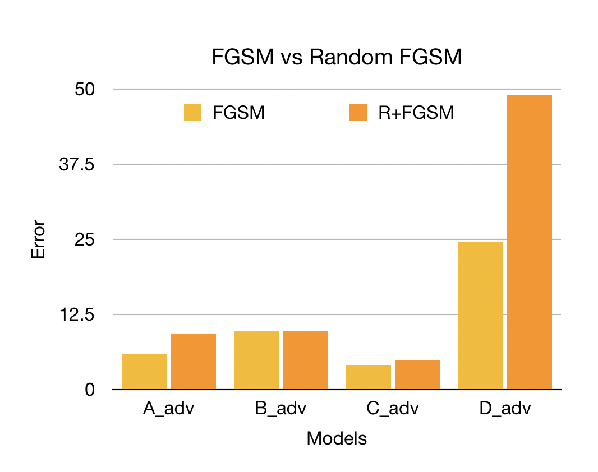
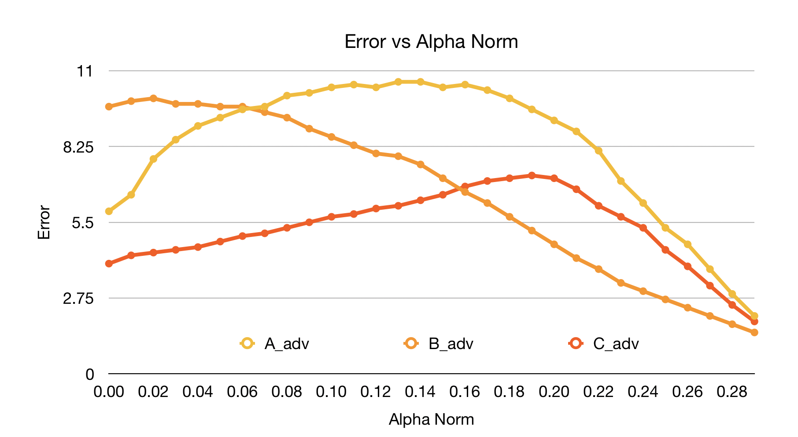

# Ensemble Adversarial Training and Random FGSM

## Problem Statement

Deep learning models can be vulnerable to maliciously perturbed inputs known as adversarial examples. These examples are crafted by making slight and often unnoticeable changes to the original inputs. In this project, we examine a new adversarial defense method (Ensemble adversarial training) and a new adversarial attack method (Random FGSM). Traditional adversarial training uses perturbed inputs generated by the model’s own parameters to increase robustness. This approach works by creating sharp curvatures in the loss of a model near data points which masks the true direction of the steepest ascent. This gradient masking degrades the linear approximation of a model’s loss used by fast single step attack methods, like FGSM.

This project focuses on exploiting gradient masking using Random FGSM and defending against gradient masking using Ensemble adversarial training. Moreover, we go beyond the scope of the original work to explore what impact the length of the random step (hereinafter referred to as alpha) has on the overall effectiveness of Random FGSM. See below for more details.

### Input and Output

Input: a clean image (e.g. original MNIST image).  
Output: a perturbed image (e.g. adversarial MNIST image).

## Deliverables
* [Pretrained models](https://github.com/servantez/CS496_Advanced_DL/tree/master/models) (undefended, adversarial and ensemble trained models)
* Script for [training models](https://github.com/servantez/CS496_Advanced_DL/blob/master/train_script.py)
* Script for [testing attack and defense performance](https://github.com/servantez/CS496_Advanced_DL/blob/master/test_script.py)
* Script for [identifying optimal alpha norm](https://github.com/servantez/CS496_Advanced_DL/blob/master/alpha_script.py) for Random FGSM attack 
* Code for [Ensemble adversarial training](https://github.com/servantez/CS496_Advanced_DL/blob/master/train_adv.py) and [Random FGSM attack](https://github.com/servantez/CS496_Advanced_DL/blob/master/simple_eval.py)
* [Dockerfile](https://github.com/servantez/CS496_Advanced_DL/blob/master/Dockerfile) used to build docker image
* [Docker image](https://hub.docker.com/r/servantez/ensemble) (ready to deploy)

## Experiments

All figures and data depicted below were generated for this project.

### Ensemble Adversarial Training

Ensemble adversarial training decreases the magnitude of gradient masking by training on perturbed inputs generated by other static pretrained models. The results below show that this approach significantly improves robustness to black box attacks over traditional adversarial training. However, we do observe a slight increase (1.5 percent) in the error rate for white box attacks.


### Random FGSM

Random FGSM is a new attack method which prepends a small step in a random direction before performing traditional FGSM. This random step is meant to escape the sharp curvatures near the data point in order to obtain a more accurate linear approximation of the model’s loss. The results below show that Random FGSM outperforms traditional FGSM for three out of four of the tested models (the fourth model was a tie). Random FGSM was able to increase the error rate of Model D by a factor of two.



### Optimizing Alpha

Alpha represents the length of the random step in Random FGSM. This length needs to be sufficient to escape the sharp curvatures near the data point, but not so long that it unnecessarily shortens the length of the FGSM step. This project explores whether the optimal value of alpha is a constant or varies across models. The graph below shows how the value of alpha affects the error rate of the attack. We can clearly observe that there is no value for alpha which optimizes the error rate for all models. That is to say, the optimal value of alpha varies across models.



## Run Project (2 options)

This project has been containerized with Docker to make running extremely easy. The Docker image performs all necessary actions, including training all models and reproducing all experiment results. The Docker image was verified to run correctly by pulling down the image from Docker Hub and running successfully on a separate machine.

### Option 1 - Run with Docker (highly recommended):

### 1. Pull down Docker image
```
docker pull servantez/ensemble:1.0
```
### 2. Run Docker image
```
docker run servantez/ensemble:1.0
```

### Option 2: Run with code

Note: this section is unnecessary if the project was run using the Docker image from option 1.

### 1. Clone repo and enter it
```
git clone https://github.com/servantez/CS496_Advanced_DL.git
cd CS496_Advanced_DL/
```
### 2. Create virtual environment and activate it
```
conda create -n ensemble python=2.7
conda activate ensemble
```
### 3. Install all requirements
```
pip install -r requirements.txt
```
### 4. Train all models
Note: this project involves training and testing many models. To improve reproducibility, scripts have been provided to automate training and testing. See the Deliverables section above for more information.  
This training script trains all models, including undefended, adversarial and ensemble trained models.
```
python train_script.py
```
### 5. Test all trained models
This testing script reproduces all experiment results for figures 1 and 2 above.
```
python test_script.py
```
### 6. Test optimal alpha
This testing script reproduces all experiment results for figure 3 above.
```
python alpha_script.py
```

## References
* [Ensemble Adversarial Training paper](https://arxiv.org/abs/1705.07204)
* [Ensemble Adversarial Training implementation](https://github.com/ftramer/ensemble-adv-training)

